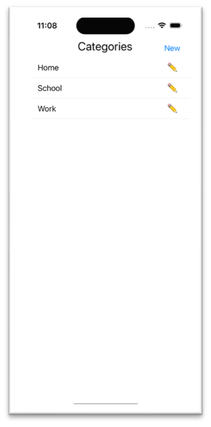
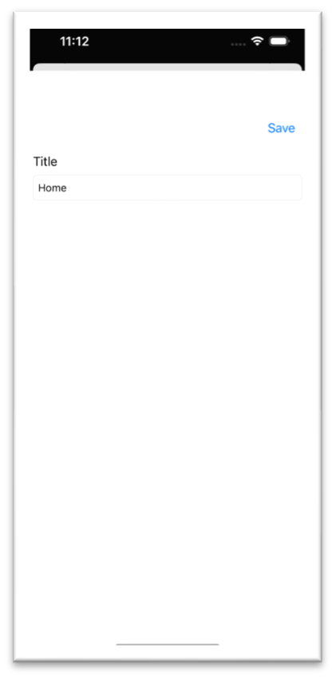
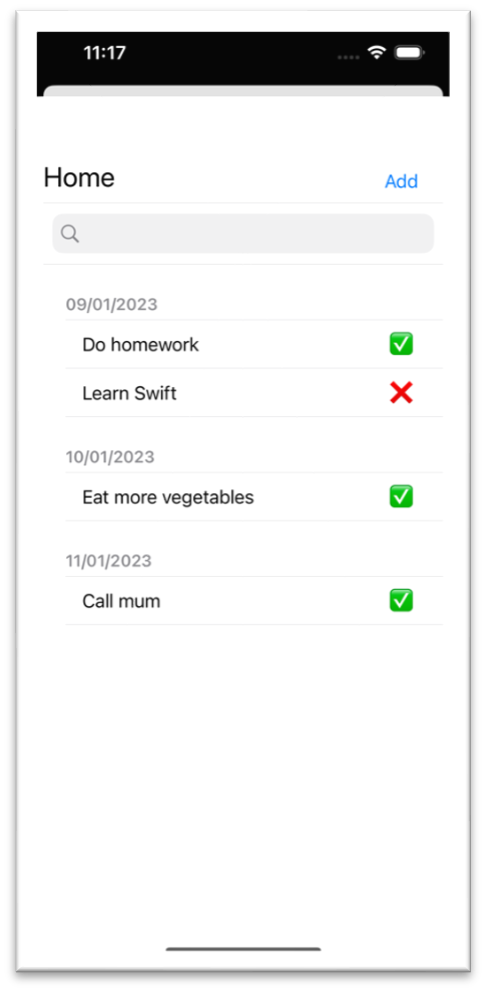
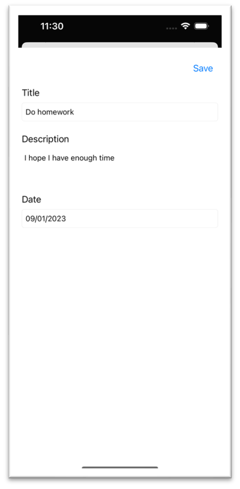

# TodoList iOS
TP Programming Application Mobile iOS

La version [pdf](DI%20SPIRITO%20Federico%20TP%20Programmation%20iOS.pdf) de ce sujet est également disponible.

## Introduction

L'application permet de créer, afficher, modifier et supprimer des tâches.

## La page d'accueil

La page principale de l'application affiche les catégories dans une TableView. Le bouton "New" en haut à droite permet d'ajouter de nouvelles catégories. Chaque cellule de la TableView affiche le titre de la catégorie et un bouton pour le modifier. Ce dernier ouvre une nouvelle View de l’application avec un champ de texte pour le titre de la catégorie et un bouton pour enregistrer les modifications.
En faisant un swipe vers la gauche sur la cellule de la TableView, on supprime la catégorie.

 

## La TodoList

En sélectionnant une catégorie, on arrive sur une nouvelle page affichant les tâches relatives à cette catégorie. Le nom de la catégorie est affiché en haut à gauche, un bouton "Add" en haut à droite permet de créer de nouvelles tâches, un champ de recherche permet de filtrer les tâches qui sont affichées dans une TableView. Les tâches sont regroupées par date par ordre croissant. Chaque cellule de la TableView affiche le titre de la tâche et un bouton pour modifier l’état de la tâche (faite ou à faire). Avec un swipe vers la gauche on supprime la tâche.

Si on sélectionne une tâche, on affiche les détails dans une nouvelle View. Cette View présente un champ de texte pour le titre de la tâche sélectionnée, un autre champ de texte pour sa description et un dernier champ de texte pour la date. De cette façon, non seulement on affiche les informations de la tâche, mais on peut aussi les modifier. Avec le bouton "Save" en haut à droite on enregistre les modifications.

## Conclusion

Les Views permettant de créer ou modifier des tâches ou des catégories, ainsi que les Views affichants les catégories et les tâches, sont très similaires. Pour qu’on puisse naviguer dans l’application en toute simplicité, j’ai choisi un design cohérent, avec les éléments principaux toujours placés aux mêmes endroits dans les différentes Views.
